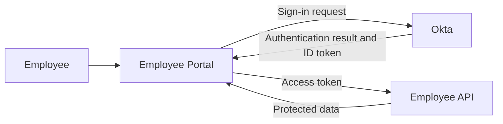
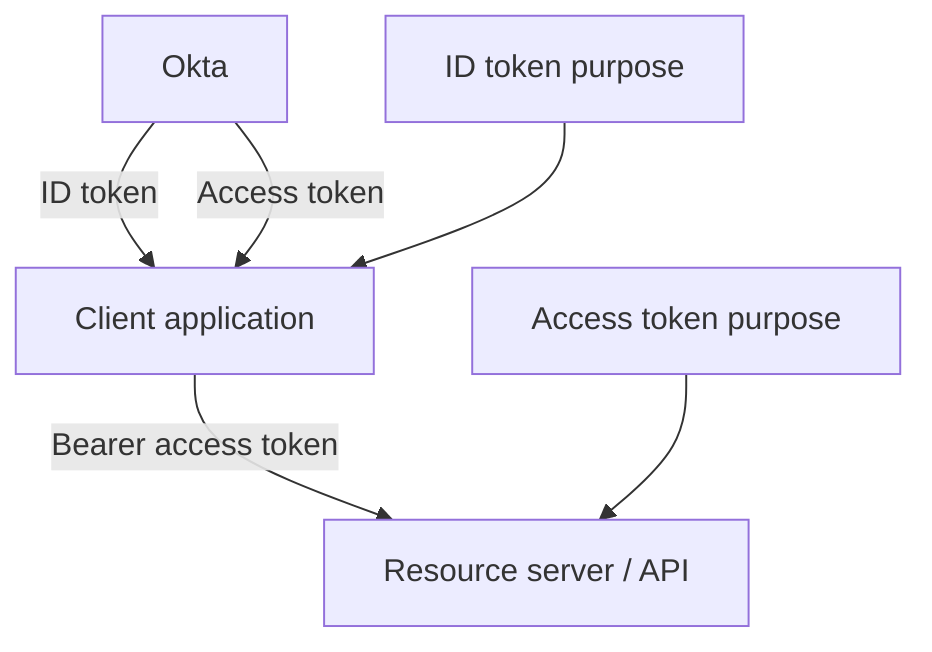
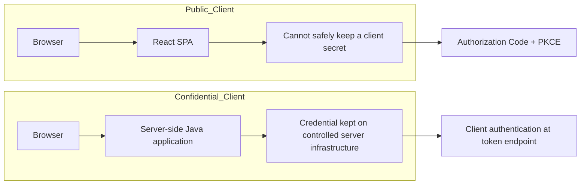
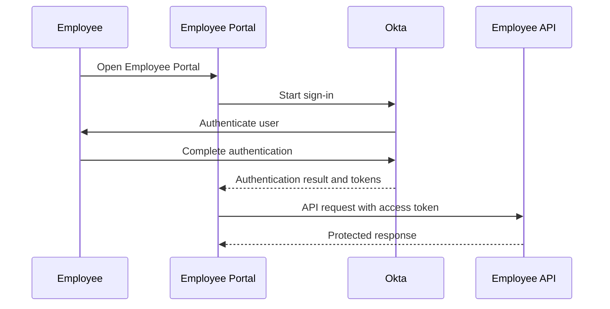
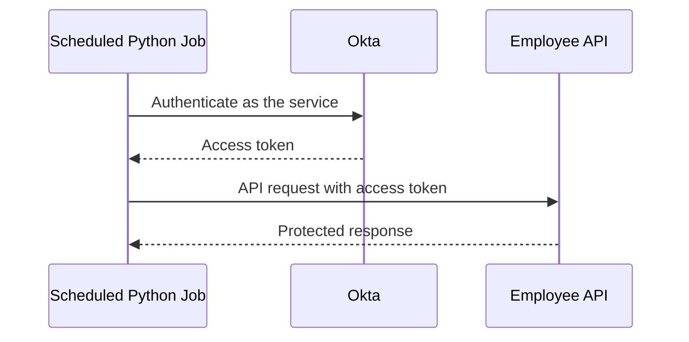
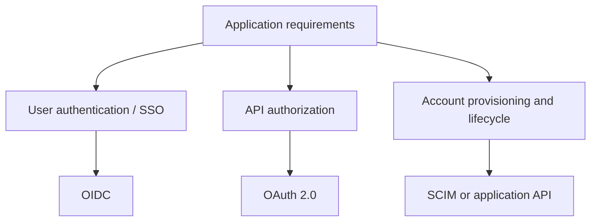

# Day 1 Flow Diagrams

These diagrams support the Day 1 lesson. They are intentionally simple. Day 2 and Day 3 add the detailed HTTP and Authorization Code + PKCE transactions.

## 1. Authentication and API authorization are separate problems

**Question answered:** Which part of the requirement is user authentication, and which part is API authorization?



Read it in two parts:

```text
Employee -> Portal -> Okta
Authentication

Portal -> Employee API
API authorization
```

## 2. Who consumes which token

**Question answered:** Which component is supposed to consume the ID token, and which component receives the access token?



Working rule:

```text
ID token
-> consumed by the client application

Access token
-> presented to the resource server / API
```

## 3. Public client and confidential client

**Question answered:** Can the application component protect a client credential from the end user?



The deciding question is:

> Can this component actually protect the credential from the end user?

## 4. User-facing application path

**Question answered:** What is the high-level path when a human user signs in and the application later calls an API?



Day 3 expands the sign-in portion into the actual Authorization Code + PKCE transaction.

## 5. Scheduled service path

**Question answered:** What changes when a service calls the API without a human user?



There is no employee browser session in this path.

```text
No human user
No interactive login
No ID token
Access token used for API access
```

Day 11 implements this using Client Credentials.

## 6. Know where OAuth/OIDC stops

**Question answered:** Which requirement belongs to OAuth/OIDC, and which requirement belongs to account provisioning/lifecycle?



A successful OIDC login does not by itself create, update, disable, or delete the downstream account.
