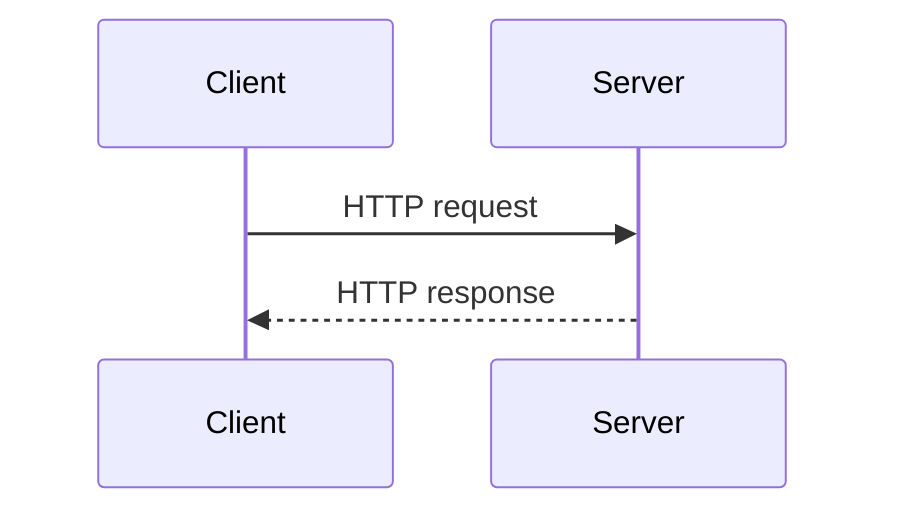
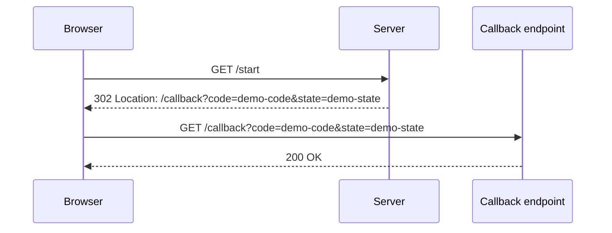
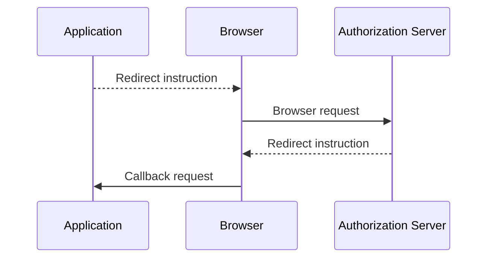
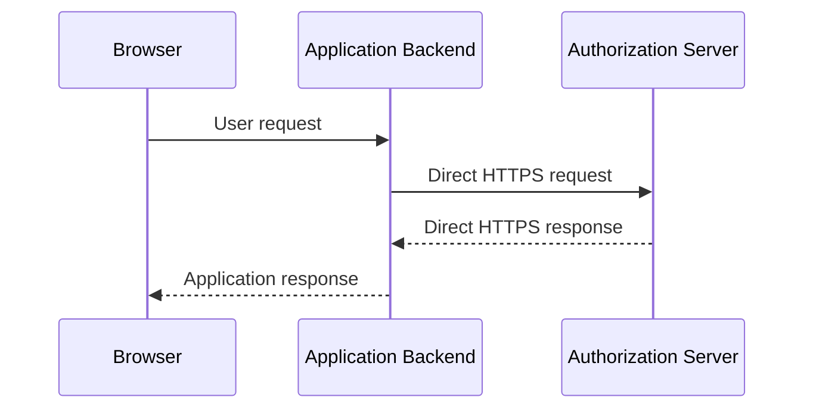
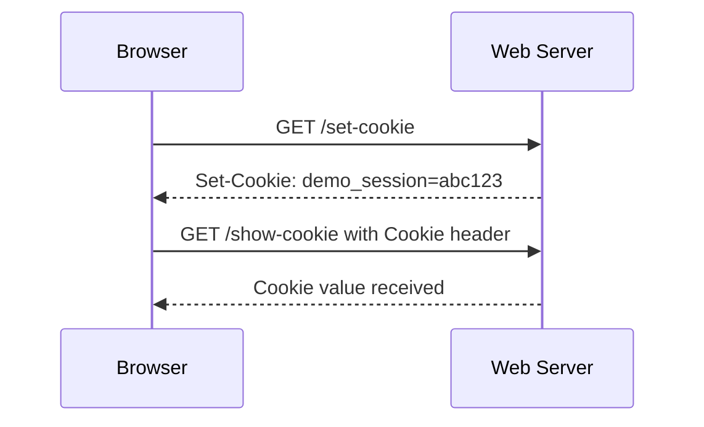
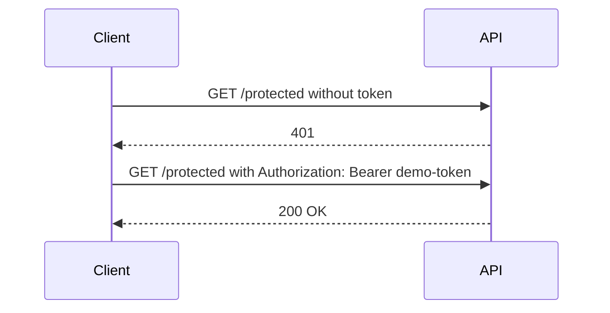

# Day 2 Flow Diagrams

These diagrams support the Day 2 lesson.

## 1. HTTP request and response

The client can be a browser, Postman, Python application, backend service, or another application component.

## 2. Redirect

The browser follows the location supplied by the server.

## 3. Front-channel communication

The browser carries the transaction between the application and authorization server.

## 4. Back-channel communication

The browser does not carry the direct backend-to-server request.

## 5. Cookie behavior

The browser can return cookies automatically for the appropriate site.

## 6. Bearer token API request

The application deliberately places the bearer token in the Authorization header.
