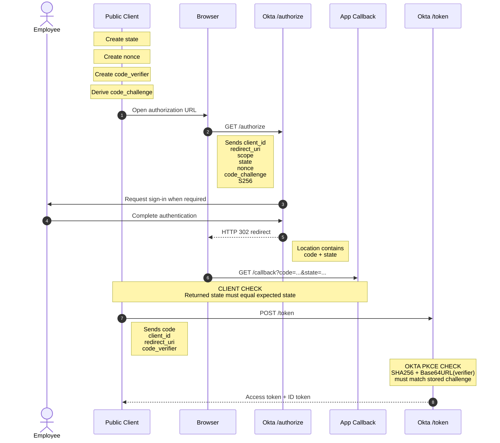
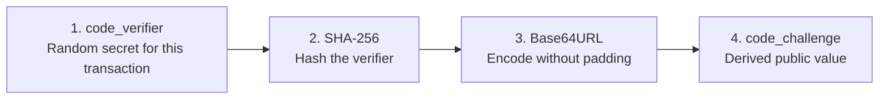
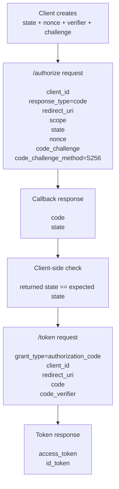
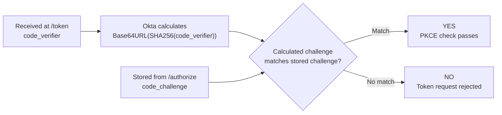
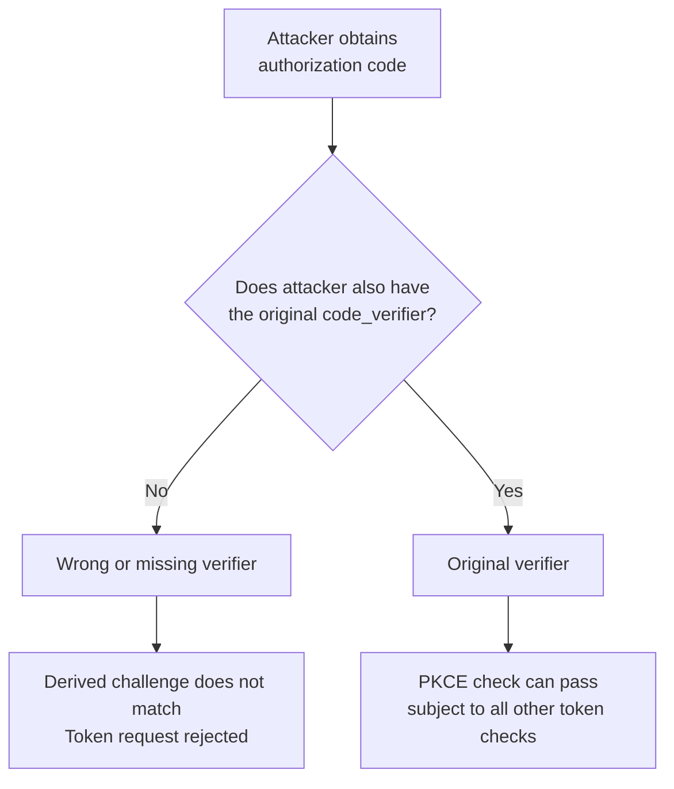
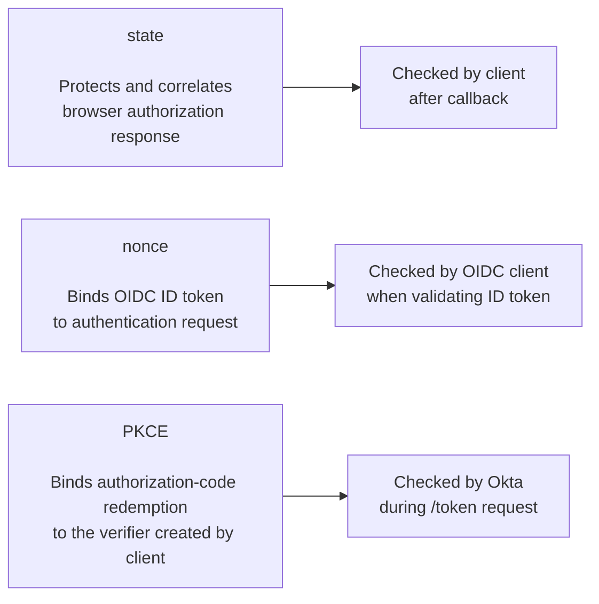
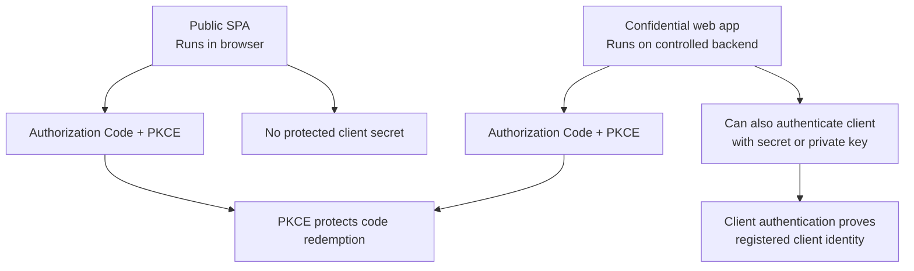

# Day 3 Flow Diagrams

These diagrams are part of the Day 3 lesson.

Each diagram answers one specific question.

## 1. Complete Authorization Code with PKCE transaction

**Question answered:** Who sends what, to whom, and in what order?



### How to read it

There are two major phases:

```text
PHASE 1
Browser authorization
/authorize
        |
        v
authorization code


PHASE 2
Code redemption
/token
        |
        v
tokens
```

PKCE connects the two phases.

## 2. How the PKCE values are created

**Question answered:** What is the relationship between the verifier and challenge?



Important:

```text
code_verifier
-> keep for /token

code_challenge
-> send to /authorize
```

## 3. Where each important value travels

**Question answered:** Which values go to /authorize, callback, and /token?



The verifier skips the browser authorization request.

It appears only when redeeming the code.

## 4. PKCE verification inside Okta

**Question answered:** What exactly does Okta compare?



## 5. Why a stolen authorization code is not enough

**Question answered:** What protection does PKCE add?



PKCE is not saying the code is harmless.

It adds another required proof for redemption.

## 6. State, nonce, and PKCE are different controls

**Question answered:** Which control protects which part of the flow?



Do not substitute one for another.

## 7. Public SPA vs confidential web application

**Question answered:** How do PKCE and client authentication differ?



Both controls can exist in the same confidential-client flow.

They solve different problems.
