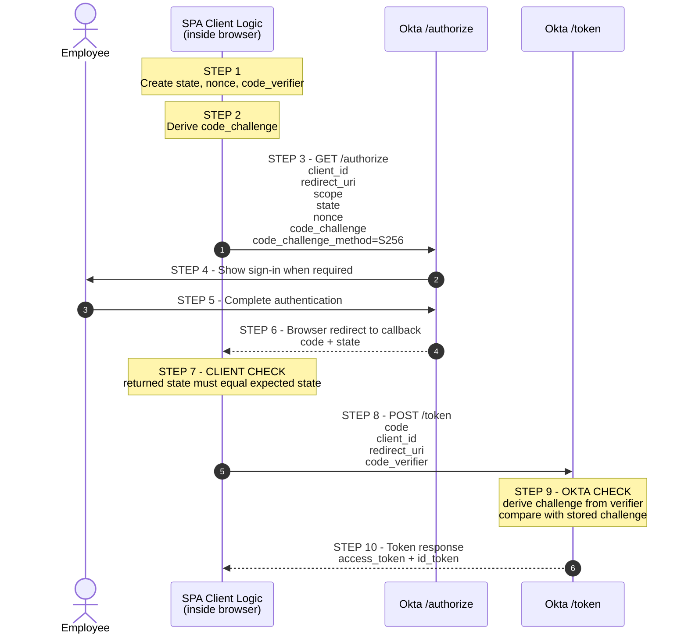
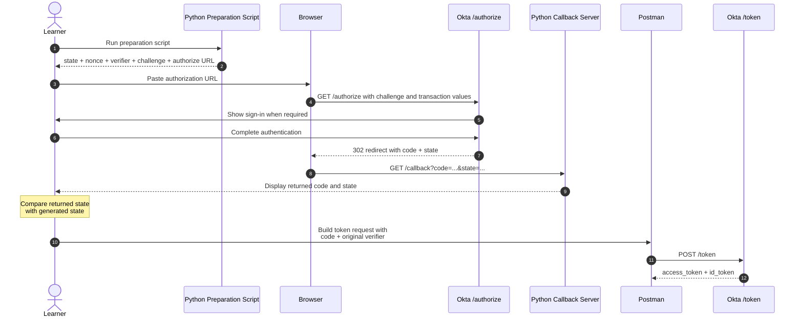
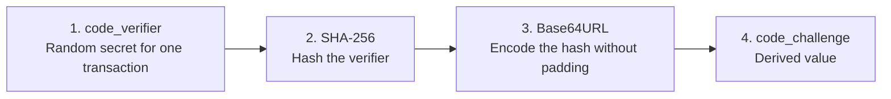
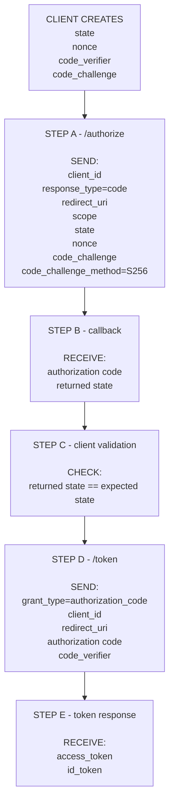
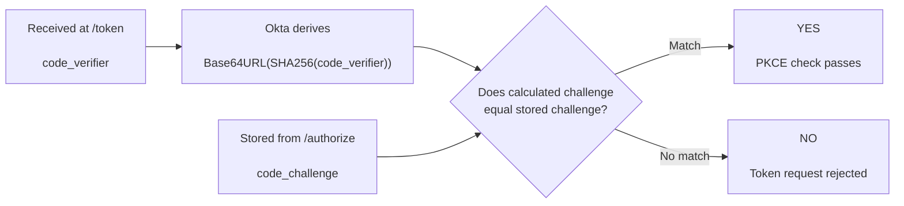
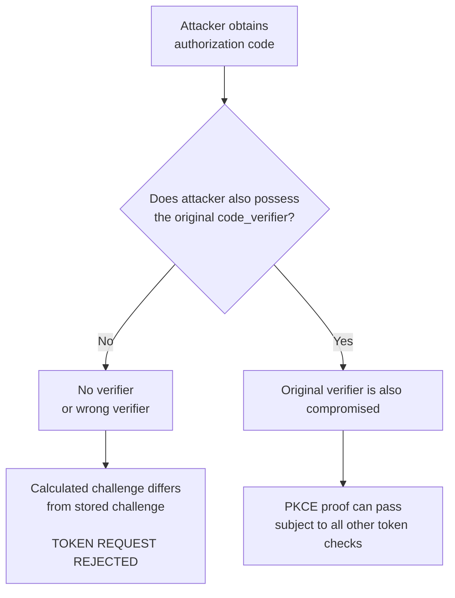
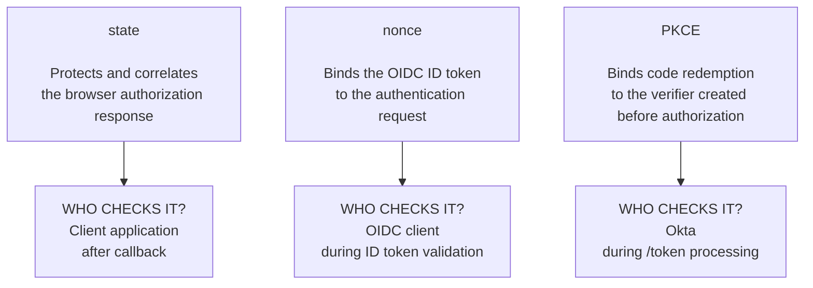
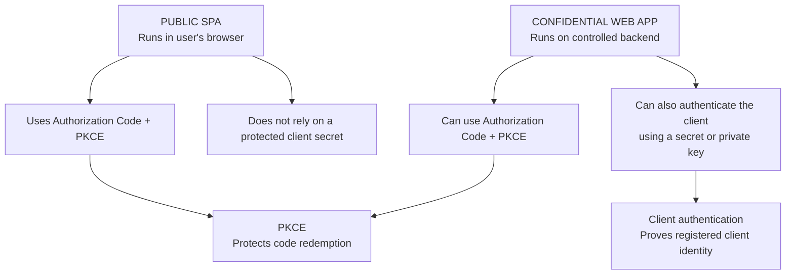

# Day 3 Flow Diagrams

These diagrams are part of the Day 3 lesson.

Each diagram answers one specific question.

## 1. Conceptual SPA Authorization Code with PKCE flow

**Question answered:** What happens in a normal SPA flow, and in what order?

The SPA client logic runs inside the browser. It is shown as one participant so the diagram does not imply that the SPA and browser are separate systems.



### Read it as two phases

```text
PHASE 1 - Browser authorization

SPA client
   |
   | GET /authorize with challenge
   v
Okta
   |
   | user authentication
   v
SPA callback receives code + state


PHASE 2 - Code redemption

SPA client
   |
   | POST /token with code + verifier
   v
Okta
   |
   | PKCE verification
   v
Tokens
```

PKCE connects Phase 1 and Phase 2.

## 2. Day 3 lab flow

**Question answered:** How does our training lab reproduce the same flow manually?

In the lab, Python and Postman temporarily perform pieces that a real SPA library would normally perform automatically.

**Important:** all of these tools together represent one logical training client. They are separated only so the learner can inspect each protocol step.



### What each lab tool represents

| Lab tool | What it is doing |
|---|---|
| Python preparation script | Generates values a real SPA library would generate |
| Browser | Carries the front-channel authorization request and redirect |
| Python callback server | Receives the browser callback for training |
| Postman | Manually performs the token request that client code would normally perform |
| Okta | Authorization server and OpenID Provider |

## 3. How the PKCE values are created

**Question answered:** What is the exact relationship between the verifier and challenge?



### Where they go

```text
code_verifier
-> keep with the client
-> send later to /token

code_challenge
-> safe derived value
-> send first to /authorize
```

## 4. Which values travel at each stage

**Question answered:** What is sent to /authorize, returned to the callback, and sent to /token?



The original verifier does **not** go to `/authorize`.

The challenge does **not** replace the verifier at `/token`.

## 5. What exactly Okta checks for PKCE

**Question answered:** What comparison causes PKCE to pass or fail?



## 6. Why a stolen authorization code is not enough

**Question answered:** What additional protection does PKCE give the code?



PKCE does not make the authorization code unimportant.

It makes possession of the code alone insufficient for a valid PKCE redemption.

## 7. State, nonce, and PKCE protect different things

**Question answered:** Which control is responsible for which validation?



### Quick comparison

| Control | Created by | Sent first | Checked by | Protects |
|---|---|---|---|---|
| `state` | Client | `/authorize` | Client | Browser authorization response |
| `nonce` | Client | `/authorize` | OIDC client | ID token binding |
| PKCE verifier/challenge | Client | Challenge at `/authorize` | Okta at `/token` | Authorization-code redemption |

## 8. Public SPA vs confidential web application

**Question answered:** How are PKCE and client authentication different?



PKCE and client authentication can both exist in a confidential-client flow.

They are not substitutes.
