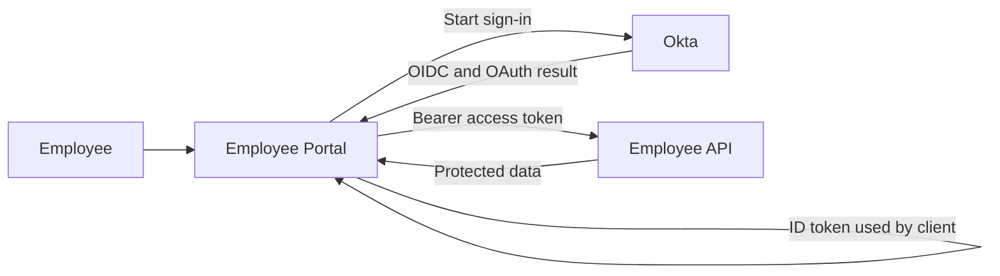
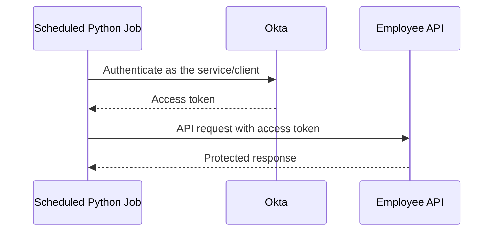

# Day 1 - Core OAuth/OIDC Logic and Architecture

## Goal for today

Today is about understanding the basic pieces before touching Okta configuration.

By the end of Day 1, you should be able to look at a simple application requirement and answer:

- Who is the user?
- Which component is the OAuth/OIDC client?
- Which component is the API or resource server?
- What does Okta do?
- Is the requirement authentication, API authorization, or both?
- Is the client public or confidential?
- Is a human user involved?
- Which component should use the ID token?
- Which component should receive the access token?

You do not need prior OAuth/OIDC knowledge for this lesson.

[Open the Day 1 flow diagrams](../diagrams/day-01-flows.md)

## Start with a real requirement

An application owner says:

> We have an Employee Portal. Employees should sign in with Okta, and after login the portal needs to call an Employee API to retrieve their profile.

It sounds like one requirement, but it contains two different problems.

```text
Problem 1

Who is this employee?
        |
        v
Authentication


Problem 2

Is this caller allowed to access Employee API data?
        |
        v
Authorization
```

Keep those two questions separate.

That separation is one of the most important habits in OAuth/OIDC work.

## Authentication

Authentication answers:

> Who is this user?

Assume the employee opens:

```text
https://employee.company.com
```

The Employee Portal does not yet know who the person is.

The sign-in process sends the user to Okta.

```text
Employee
   |
   v
Employee Portal
   |
   | Need this user authenticated
   v
Okta
```

Okta authenticates the user.

Depending on the policy, authentication could involve:

```text
username
password
MFA
device or contextual checks
```

After successful authentication, the client application needs a standard way to receive information about that authentication and the user.

This is where OpenID Connect, or OIDC, fits.

## What OIDC adds

OIDC is an authentication layer built on OAuth 2.0.

OIDC introduces the ID token.

The ID token is issued by the OpenID Provider. In our example, Okta is the OpenID Provider.

The ID token contains claims about the authentication event and the authenticated user.

At a high level:

```text
Employee
   |
   v
Okta
   |
   | user authenticated
   v
OIDC result
   |
   | includes an ID token
   v
Employee Portal
```

The important relationship is:

```text
ID token
   |
   v
Client application
```

The client application validates and consumes the ID token.

The ID token is not intended to be used as the normal bearer credential for your application API.

We will inspect ID token contents and validation in later days.

## Authorization

Authorization answers a different question:

> What is this caller allowed to do?

The Employee Portal also needs to call the Employee API.

For example:

```http
GET /api/profile
```

The Employee API does not make its authorization decision from the user's Okta browser session.

It expects an API credential.

In OAuth 2.0, that credential is normally an access token.

```text
Employee Portal
       |
       | Authorization: Bearer <access_token>
       v
Employee API
```

The API receives the access token and decides whether the request should be allowed.

Later in the course, you will learn the exact validation steps.

For now, the API will care about things such as:

```text
Is the token trusted?
Is it from the expected issuer?
Is it intended for this API?
Has it expired?
Does it contain the required scope or permission?
```

If the token is valid and the caller has the required permission:

```text
GET /api/profile
        |
        v
200 OK
```

## ID token and access token are for different consumers

Keep this relationship clear:

```text
ID token
   |
   v
Client application


Access token
   |
   v
Resource server / API
```

A useful question is:

> Who is supposed to consume this token?

That question is more useful than memorizing a short definition.

### ID token

The ID token is for the client application.

It tells the client about the authentication event and the user.

### Access token

The access token is for a protected resource, usually an API.

It represents permission to access that protected resource.

An access token can be issued in different situations.

For example:

```text
User-facing application
-> access token can represent delegated access involving a user

Machine-to-machine application
-> access token can represent the service/client itself
```

So an access token does not always mean there is a human user.

That distinction will matter when we reach Client Credentials.

## How OIDC and OAuth fit together

A user-facing application often uses OIDC and OAuth together.

At a high level:



Read the flow as two related jobs.

```text
Employee -> Portal -> Okta
Authentication

Portal -> Employee API
API authorization
```

OIDC handles the application's need to know about the authenticated user.

OAuth 2.0 handles access to protected resources such as APIs.

People sometimes use the phrase "OAuth login" loosely. When you hear it on a project, translate it into the actual requirement.

Ask:

```text
Do they need user authentication?
Do they need API access?
Do they need both?
```

## The actors in our example

OAuth/OIDC documentation uses specific names for the components.

For our Employee Portal example:

| Term | Project component | What it does |
|---|---|---|
| End user | Employee | Uses the application |
| Resource owner | Employee in this user-delegated example | Owns or grants access to protected resources |
| Client | Employee Portal | Requests authentication and/or tokens |
| Authorization server | Okta | Authorizes requests and issues tokens |
| OpenID Provider | Okta when OIDC is used | Issues ID tokens |
| Resource server | Employee API | Hosts protected API resources and accepts access tokens |
| Protected resource | Employee profile data or API operation | The data or operation being protected |

You do not need to memorize this table word for word.

You do need to recognize these roles when looking at an architecture diagram.

## The client

The client is the application that requests authorization or tokens.

In our example:

```text
Employee Portal
      =
OAuth/OIDC client
```

A client can be:

```text
browser SPA
server-side web application
mobile application
command-line application
background service
scheduled job
```

The client type matters because different applications have different abilities to protect credentials.

## The authorization server

The authorization server is responsible for the OAuth/OIDC authorization process and token issuance.

In our example:

```text
Okta
  =
Authorization Server
```

When OIDC is used, Okta also acts as the OpenID Provider.

Later you will learn that Okta can have different authorization servers with different purposes.

For Day 1, just understand the role.

## The resource server

The resource server is the API that hosts the protected resource.

In our example:

```text
Employee API
     =
Resource Server
```

The resource server receives the access token and decides whether the API request is allowed.

Important:

> An API is not automatically an OAuth client.

In this example, the Employee API is acting as a resource server.

A component can have more than one role in a larger architecture, but do not assign roles that it is not actually performing.

## Public and confidential clients

This distinction is based on whether the client can protect its credentials.

### Public client

Suppose the Employee Portal is a React SPA running in the browser.

If you place a client secret in JavaScript:

```javascript
const clientSecret = "SUPER-SECRET-123";
```

the person using the browser can inspect it.

They can inspect:

```text
JavaScript bundles
browser DevTools
network requests
browser storage
page source
```

A browser SPA therefore cannot safely depend on a client secret.

```text
React SPA
   |
   v
Public client
   |
   v
Cannot safely keep a client secret
```

For the normal browser-based authorization flow, we will use Authorization Code with PKCE.

We will teach exactly how PKCE works on Day 3.

### Confidential client

Now consider a server-side Java web application.

```text
Browser
   |
   v
Java Web Server
```

The Java server runs on infrastructure controlled by the organization.

The backend may be able to protect credentials such as:

```text
client secret
private key
```

So the server-side application can operate as a confidential client.

```text
Server-side application
        |
        v
Confidential client
        |
        v
Can authenticate itself to the token endpoint
```

A confidential client can also use PKCE.

Client authentication and PKCE are not the same control. We will cover that later.

### The practical test

Do not ask:

> Did Okta generate a client secret?

Ask:

> Can this application component actually protect that credential from the end user?

That is the practical distinction.

## Frontend, backend, API, and service are not the same thing

A real application may contain several components:

```text
Browser
Frontend application
Backend web application
API
Background service
Okta
```

Do not treat the whole system as one OAuth component.

For example:

```text
React frontend
-> may be an OAuth public client

Java backend
-> may be a confidential client

Employee API
-> resource server

Scheduled Python job
-> confidential machine-to-machine client

Okta
-> authorization server
```

This becomes very important during troubleshooting.

Always ask:

> Which component made this request?

and:

> Which component rejected it?

## Add a scheduled Python job

The application owner adds another requirement:

> Every night at 1 AM, a Python job needs to call the Employee API.

Start with the simplest question:

> Is a human user present?

No.

There is nobody sitting at the browser at 1 AM.

So an interactive browser login is the wrong pattern.

Instead:



This is machine-to-machine access.

The scheduled job needs an access token for the API.

It does not need an ID token because no human user is being authenticated for the job.

```text
No human user
No interactive browser login
No ID token for user authentication
Access token required for API access
```

Later, we will implement this with Client Credentials.

## Authentication success does not prove API success

This is an important troubleshooting habit to learn on Day 1.

Suppose a user reports:

> Okta login works, but the application still fails.

The transaction might look like this:

```text
User authentication succeeds
        |
        v
Authorization result returned
        |
        v
Tokens issued
        |
        v
Application calls API
        |
        v
API rejects access token
```

In that case:

```text
Authentication succeeded
API access failed
```

Do not call every failure after login an authentication problem.

Later in the course, we will use this question repeatedly:

> What is the last step I can prove succeeded?

## Where OAuth/OIDC stops

The application owner adds another requirement:

> When someone joins the company, create their SaaS account. When they leave, disable it.

That is not the same problem as login or API authorization.

```text
OIDC
-> user authentication and identity information for the client

OAuth 2.0
-> authorization to protected resources such as APIs

SCIM or application API
-> account provisioning and lifecycle operations

SAML
-> another protocol commonly used for enterprise SSO
```

A successful OIDC login does not automatically create, update, disable, or delete a downstream account.

That boundary is enough for this course. SAML and SCIM should be learned separately.

## Common mistakes to catch early

### Mistake 1: Putting a client secret in a browser SPA

Why it is wrong:

The browser cannot protect the secret from the person using the browser.

### Mistake 2: Sending the ID token to your API as its normal bearer token

Why it is wrong:

The ID token is issued for the client application. The access token is the token intended for protected API access.

### Mistake 3: Using an interactive user flow for a nightly service

Why it is wrong:

A scheduled job has no human user available to complete an interactive sign-in.

### Mistake 4: Assuming successful login means the API must accept the request

Why it is wrong:

Authentication and API authorization are different parts of the transaction.

### Mistake 5: Assuming OIDC performs provisioning

Why it is wrong:

OIDC addresses authentication. Provisioning is a separate lifecycle function.

## What you should be able to explain now

Without reading the definitions, try to explain these in your own words:

1. What is the difference between authentication and authorization?
2. What problem does OIDC solve?
3. What problem does OAuth 2.0 solve?
4. What is an ID token for?
5. What is an access token for?
6. What is a client?
7. What is an authorization server?
8. What is a resource server?
9. Why is a React SPA a public client?
10. Why can a backend service be confidential?
11. Why does a scheduled job not need an ID token?
12. Why can login succeed while an API call still fails?

If any answer still feels like memorized wording, go back to the scenario and diagram.

The goal is to understand the relationships.

## Day 1 lab

Once the lesson is clear, continue with:

[Day 1 Lab - Architecture and Requirements](../labs/day-01-architecture-and-requirements.md)

Do the lab before moving to Day 2.

The lab does not introduce new concepts. It checks whether you can apply what this lesson taught.

## Day 1 completion standard

Day 1 is complete when you can look at a basic application diagram and identify:

- the end user
- the OAuth/OIDC client
- the authorization server
- the OpenID Provider when OIDC is used
- the resource server
- whether authentication is needed
- whether API authorization is needed
- whether the client is public or confidential
- whether a human user is present
- which component consumes the ID token
- which component receives the access token

You should also be able to explain why you made each classification.

## Official references

These are reference material, not required reading before the lesson.

- [Okta: OAuth 2.0 and OpenID Connect overview](https://developer.okta.com/docs/concepts/oauth-openid/)
- [Okta: Client authentication methods](https://developer.okta.com/docs/api/openapi/okta-oauth/guides/client-auth)
- [Okta: Authorization servers](https://developer.okta.com/docs/concepts/auth-servers/)
- [Okta: Client Credentials grant](https://developer.okta.com/docs/guides/implement-grant-type/clientcreds/main/)
