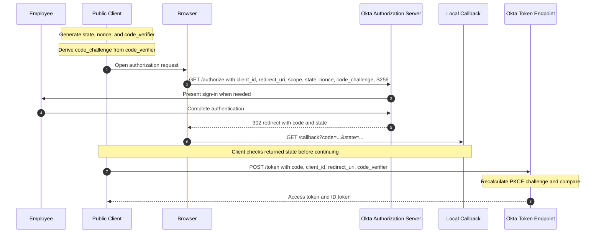

# Day 3 - Authorization Code with PKCE

## Goal for today

Today you will learn the first complete OAuth/OIDC authorization flow.

You will understand:

- why the Authorization Code flow uses an intermediate code
- why a browser-based public client should not depend on a client secret
- what PKCE adds to the Authorization Code flow
- what `code_verifier` and `code_challenge` do
- what `state` does
- what `nonce` does
- what `client_id` identifies
- what `redirect_uri` controls
- what goes to `/authorize`
- what comes back to the callback
- what goes to `/token`
- what Okta checks before issuing tokens
- why client authentication and PKCE are different controls

This lesson assumes only the Day 1 and Day 2 material.

[Open the Day 3 flow diagrams](../diagrams/day-03-authorization-code-pkce.md)

## Start with the problem

Assume we have a React Employee Portal.

The employee needs to sign in with Okta.

The React application is a public client because code running in the browser cannot safely keep a client secret.

We still need a secure way for the application to obtain tokens.

A simple but unsafe idea would be:

```text
Browser goes to Okta
        |
        v
Okta authenticates user
        |
        v
Okta sends access token directly through browser redirect
```

Modern applications should instead use Authorization Code with PKCE.

The important difference is that the browser first receives a short-lived authorization code, not the final access token.

```text
Browser goes to Okta
        |
        v
User authenticates
        |
        v
Browser receives authorization code
        |
        v
Client exchanges code at /token
        |
        v
Tokens are returned
```

That gives us a separate code-redemption step that can be protected with PKCE.

## What is an authorization code?

An authorization code is a temporary value issued by the authorization server after the authorization request succeeds.

It is not the access token.

Think of it as:

> A short-lived, single-use value that the client can exchange for tokens.

The browser can carry the code back to the application's callback.

For example:

```text
http://localhost:8000/callback?code=ABC123&state=XYZ789
```

The code is then sent to the token endpoint.

```text
Authorization code
        |
        v
POST /token
        |
        v
Tokens
```

Okta documents authorization codes as single-use and short-lived. In the current Okta PKCE guide, the code is valid for 300 seconds.

Do not treat the authorization code as a reusable credential.

## Why not just use a client secret in React?

A client secret only works as a secret if the client can protect it.

A React SPA runs in the user's browser.

Anything shipped to that browser can be inspected by the user.

```text
React bundle
browser DevTools
network traffic
browser storage
```

So this is not a valid security design:

```javascript
const clientSecret = "secret-value";
```

A public SPA therefore uses no client secret for this flow.

Instead, Authorization Code with PKCE gives the authorization-code transaction its own proof.

## The problem PKCE solves

Suppose a legitimate client starts an authorization flow and Okta later returns:

```text
code=ABC123
```

Now imagine another party somehow obtains that authorization code before the legitimate client redeems it.

Without an additional proof, possession of the code could be enough to attempt redemption.

```text
Stolen authorization code
          |
          v
       /token
          |
          v
Attempt to obtain tokens
```

PKCE changes this.

Before the authorization request begins, the client creates a secret value for that one transaction.

That value is called the:

```text
code_verifier
```

The verifier itself is not sent in the authorization request.

Instead, the client derives another value from it:

```text
code_challenge
```

For the S256 method:

```text
code_challenge =
BASE64URL(
    SHA256(code_verifier)
)
```

The authorization request carries the challenge.

The later token request carries the original verifier.

Okta checks that they belong together.

## The PKCE relationship

The client generates:

```text
code_verifier
```

Example shape:

```text
random-high-entropy-url-safe-value
```

Okta's current guide states that the verifier is a random URL-safe string with a minimum length of 43 characters.

The client then calculates:

```text
SHA256(code_verifier)
        |
        v
Base64URL without padding
        |
        v
code_challenge
```

The client keeps the verifier for later.

It sends only the challenge during authorization.

```text
/authorize
    |
    +-- code_challenge=<derived value>
    |
    +-- code_challenge_method=S256
```

Later:

```text
/token
    |
    +-- code=<authorization code>
    |
    +-- code_verifier=<original verifier>
```

Okta calculates the expected challenge from the verifier received at `/token`.

Then it compares:

```text
Challenge calculated from received verifier
                    |
                    | compare
                    v
Challenge stored from /authorize request
```

If they match, the PKCE proof is valid.

If they do not match, token issuance is rejected.

## Why stealing only the code is not enough

Suppose an attacker obtains:

```text
code=ABC123
```

but does not have the original verifier.

The attacker sends:

```text
POST /token

code=ABC123
code_verifier=wrong-value
```

Okta derives a challenge from the wrong verifier.

```text
wrong verifier
     |
     v
SHA256 + Base64URL
     |
     v
different challenge
```

That does not match the challenge associated with the authorization transaction.

The token request is rejected.

The core PKCE rule is:

> The authorization code alone is not enough. The client must also prove possession of the verifier created for that authorization transaction.

## S256

For the PKCE flow we use:

```text
code_challenge_method=S256
```

S256 means the challenge is derived using SHA-256.

You do not need to perform the hash manually.

You do need to understand this relationship:

```text
verifier
   |
   | SHA-256
   v
hash
   |
   | Base64URL
   v
challenge
```

The challenge can be sent to Okta.

The original verifier is kept by the client until the token exchange.

## What is client_id?

When you create an OIDC application integration in Okta, Okta gives it a client ID.

Example shape:

```text
0oa...
```

The client ID identifies the application integration.

It is not a password.

It is not treated like a client secret.

In our Day 3 lab:

```text
React training app
       |
       v
Okta SPA app integration
       |
       v
client_id
```

Okta uses the client ID to find the application's configuration.

That configuration includes things such as:

```text
application type
allowed grant types
redirect URIs
assignments
sign-in policy
```

## What is redirect_uri?

The redirect URI tells Okta where the browser should be sent after the authorization step.

For our lab:

```text
http://localhost:8000/callback
```

That URI must be registered on the Okta app integration.

The authorization request then sends the same callback location:

```text
redirect_uri=http://localhost:8000/callback
```

After successful authorization, the browser returns there with values such as:

```text
code
state
```

Conceptually:

```text
Okta
  |
  | HTTP redirect
  v
Browser
  |
  | GET /callback?code=...&state=...
  v
Application callback
```

The redirect URI is a security boundary.

Okta should not send the authorization result to an arbitrary location supplied by anyone making a request.

## What is state?

`state` protects the client-side authorization transaction.

Before redirecting the browser to Okta, the client creates a random value.

Example:

```text
state = G7x9...
```

It remembers that value.

Then it sends:

```text
/authorize?...&state=G7x9...
```

Okta returns the same value in the browser response:

```text
/callback?code=ABC123&state=G7x9...
```

The client compares:

```text
Expected state
      |
      | compare
      v
Returned state
```

If they do not match, the client should not continue the transaction.

Okta describes `state` as a value used to help protect against cross-site request forgery.

Important:

> Okta echoes the state value. The client is responsible for checking it.

A state mismatch is therefore a client-side validation failure, not a PKCE failure.

## What is nonce?

`nonce` belongs to the OIDC authentication side.

The client generates a random nonce and sends it in the authorization request.

```text
/authorize?...&nonce=N123...
```

When an ID token is issued, the nonce can be used by the client to bind that ID token to the authentication request it started.

Keep the responsibilities separate:

| Value | Main purpose |
|---|---|
| `state` | Correlate and protect the browser authorization response |
| `nonce` | Bind the OIDC ID token to the authentication request |
| `code_verifier` | Secret PKCE proof kept by the client until token exchange |
| `code_challenge` | Derived PKCE value sent in the authorization request |

We will inspect ID token claims and nonce validation more deeply on Day 4 and Day 5.

For Day 3, understand why nonce exists and where it travels.

## The full Authorization Code with PKCE flow

Here is the complete transaction at the level you need today.



Read the numbered flow slowly.

### Before the browser leaves

The client creates:

```text
state
nonce
code_verifier
code_challenge
```

### Authorization request

The browser sends:

```text
GET /authorize
```

with values including:

```text
client_id
response_type=code
redirect_uri
scope
state
nonce
code_challenge
code_challenge_method=S256
```

### Callback

Okta returns the browser to:

```text
redirect_uri
```

with:

```text
code
state
```

### Client checks state

The client compares the returned `state` with the value it generated before starting the request.

### Token exchange

The client sends:

```text
POST /token
```

with:

```text
grant_type=authorization_code
client_id
redirect_uri
code
code_verifier
```

### PKCE verification

Okta derives a challenge from the submitted verifier and compares it to the challenge associated with the authorization request.

### Token response

If the transaction is valid, Okta returns applicable tokens.

For our OIDC request using the `openid` scope, the response includes an ID token. It also includes an access token.

We will study the contents and lifecycle of those tokens on Day 4.

## What goes through the browser and what does not?

This is important.

### Front channel

The browser carries the authorization request:

```text
client_id
redirect_uri
scope
state
nonce
code_challenge
```

The browser also carries the authorization response:

```text
code
state
```

### Token request

The token request carries:

```text
code
code_verifier
client_id
redirect_uri
```

The original verifier is not placed in the authorization request.

That separation is the key PKCE design.

## The actual /authorize request

For the Day 3 lab, we will use the Okta org authorization server.

The authorization endpoint is:

```text
https://{yourOktaDomain}/oauth2/v1/authorize
```

A request will look like:

```text
https://{yourOktaDomain}/oauth2/v1/authorize
?client_id={clientId}
&response_type=code
&scope=openid%20profile%20email
&redirect_uri=http%3A%2F%2Flocalhost%3A8000%2Fcallback
&state={randomState}
&nonce={randomNonce}
&code_challenge={derivedChallenge}
&code_challenge_method=S256
```

Do not memorize the URL.

Be able to explain every parameter.

| Parameter | Why it is present |
|---|---|
| `client_id` | Identifies the Okta app integration |
| `response_type=code` | Requests an authorization code |
| `scope` | Requests OIDC/OAuth permissions |
| `redirect_uri` | Tells Okta where the browser should return |
| `state` | Lets the client validate the returned browser transaction |
| `nonce` | Lets the OIDC client bind the ID token to the request |
| `code_challenge` | Sends the derived PKCE proof |
| `code_challenge_method=S256` | Says the challenge was derived using SHA-256 |

## The callback

After authentication and authorization succeeds, the browser is redirected to something like:

```text
http://localhost:8000/callback
?code={authorizationCode}
&state={returnedState}
```

The authorization code is sensitive even though it is short-lived.

Do not post a live code into chat, tickets, documentation, or screenshots.

## The actual /token request

For the Okta org authorization server, the token endpoint is:

```text
https://{yourOktaDomain}/oauth2/v1/token
```

The request is:

```http
POST /oauth2/v1/token
Content-Type: application/x-www-form-urlencoded
Accept: application/json
```

The form body contains:

```text
grant_type=authorization_code
client_id={clientId}
redirect_uri=http://localhost:8000/callback
code={authorizationCode}
code_verifier={originalVerifier}
```

For the public SPA app integration used in this lab, there is no client secret.

The original verifier is the additional proof.

## Why redirect_uri appears again at /token

The token request includes the same redirect URI used for the authorization request.

Do not casually change it between the two steps.

Think of the code redemption as continuing the same authorization transaction.

The important values must stay consistent with the transaction that produced the code.

## Why the code is single-use

Assume the legitimate client exchanges:

```text
code=ABC123
```

successfully.

If the same code could be exchanged repeatedly, anyone who obtained that old code could keep requesting new tokens.

So the code is single-use.

The first successful redemption consumes it.

A second redemption attempt should fail.

## PKCE and client authentication are different

This is an important distinction.

### PKCE

PKCE answers:

> Does the party redeeming this authorization code possess the verifier associated with the authorization request?

### Client authentication

Client authentication answers:

> Can this client prove its registered client identity using a protected credential such as a secret or private key?

A public SPA cannot safely protect a client secret, so its Okta app integration uses no client secret for this flow.

A confidential server-side application can authenticate itself at the token endpoint and can also use PKCE.

So:

```text
client authentication
!=
PKCE
```

They solve different problems.

## What Okta checks at the token step

At a high level, Okta evaluates whether the token request is a valid continuation of the authorization transaction.

For this lab, think about:

```text
Is the authorization code valid?
Has the code already been used?
Is the code still within its lifetime?
Is the client ID correct for the transaction?
Is the redirect URI consistent?
Does the code_verifier produce the expected code_challenge?
```

If the checks pass, tokens can be issued.

If one of the required checks fails, the token request is rejected.

## A successful flow does not mean every later flow is identical

Today we use:

```text
Public SPA
Authorization Code
PKCE
No client secret
Okta org authorization server
```

Later you will also see:

```text
Confidential web application
Authorization Code
PKCE
Client authentication
```

and:

```text
Service application
Client Credentials
No human user
```

Do not force one flow onto every application.

## Common mistakes to catch early

### Mistake 1: Putting the verifier into /authorize

Wrong.

The authorization request sends the challenge.

The original verifier is held for the token request.

### Mistake 2: Treating state as PKCE

Wrong.

`state` protects the browser authorization transaction.

PKCE protects authorization-code redemption.

### Mistake 3: Treating nonce as state

Wrong.

The nonce belongs to OIDC ID token validation.

### Mistake 4: Using a client secret in browser JavaScript

Wrong.

A browser SPA is a public client and cannot safely protect the secret.

### Mistake 5: Thinking the authorization code is the access token

Wrong.

The authorization code is exchanged at the token endpoint.

### Mistake 6: Reusing an authorization code

Wrong.

The authorization code is single-use.

### Mistake 7: Assuming Okta validates state for your application

Wrong.

Okta returns the state value. The client must compare returned state with the state it originally generated.

## What you should be able to explain now

Before doing the lab, explain these in your own words:

1. Why does Authorization Code flow return a code before tokens?
2. Why can a React SPA not depend on a client secret?
3. What is the code verifier?
4. What is the code challenge?
5. Which one goes to `/authorize`?
6. Which one goes to `/token`?
7. What does Okta compare for PKCE?
8. What does `state` protect?
9. Who validates `state`?
10. What does `nonce` relate to?
11. What is the redirect URI?
12. What does the client ID identify?
13. Why is an authorization code single-use?
14. Why are PKCE and client authentication not the same thing?

If those answers make sense, continue to the lab.

## Day 3 lab

[Day 3 Lab - Run Authorization Code with PKCE against Okta](../labs/day-03-authorization-code-pkce.md)

In the lab you will:

- create a real Okta SPA app integration
- start a local callback server
- generate state, nonce, verifier, and challenge
- open a real `/authorize` request in the browser
- authenticate with Okta
- capture the returned code and state
- compare state
- manually exchange the code in Postman
- receive real tokens
- intentionally send a wrong verifier
- intentionally reuse an authorization code
- diagnose each failure from the exact failed step

## Day 3 completion standard

Day 3 is complete when you can draw the flow from memory and explain:

```text
What the client creates before /authorize
What travels through the browser
What comes back to the callback
What the client validates
What is sent to /token
What Okta checks
Why the verifier must remain with the client
Why a stolen code alone should not be sufficient
```

## Official references

- [Okta: Authorization Code with PKCE](https://developer.okta.com/docs/guides/implement-grant-type/authcodepkce/main/)
- [Okta: OAuth 2.0 and OpenID Connect overview](https://developer.okta.com/docs/concepts/oauth-openid/)
- [Okta: Create an app integration](https://developer.okta.com/docs/guides/create-an-app-integration/-/main/)
